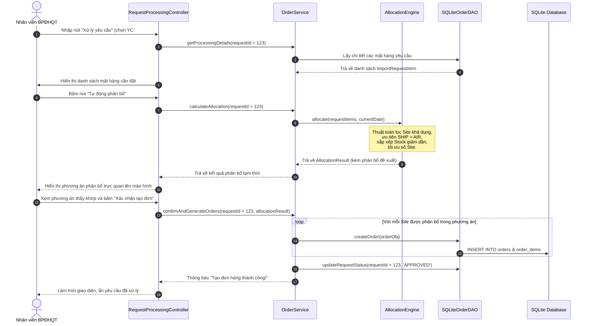

# Kế Hoạch Thiết Kế Kiến Trúc & Triển Khai Chi Tiết — Hệ Thống Đặt Hàng Nhập Khẩu

Bản kế hoạch này được thiết kế dựa trên các yêu cầu công nghệ của bạn: **Java (21+)**, **JavaFX**, **SQLite** (với định hướng dễ dàng nâng cấp lên **Supabase**), áp dụng kiến trúc **Layered MVC kết hợp DAO**.

---

## 1. Cấu Trúc Thư Mục Project (Maven Standard Directory Layout)

Dự án sẽ tuân theo cấu trúc chuẩn của Maven để quản lý mã nguồn Java và tài nguyên JavaFX một cách khoa học:

```
Import System/
├── pom.xml                                   # File cấu hình Maven (dependencies, plugins)
└── src/
    ├── main/
    │   ├── java/                             # Thư mục chứa mã nguồn Java
    │   │   └── com/
    │   │       └── nhom18/
    │   │           └── importorder/
    │   │               ├── App.java          # Lớp khởi chạy ứng dụng (extends javafx.application.Application)
    │   │               │
    │   │               ├── config/           # Cấu hình hệ thống (DB connection, paths)
    │   │               │   └── AppConfig.java
    │   │               │
    │   │               ├── model/            # Tầng Entity & DTO
    │   │               │   ├── entity/       # Các thực thể ánh xạ database
    │   │               │   ├── dto/          # Data Transfer Object (gom cụm dữ liệu hiển thị)
    │   │               │   └── enums/        # Các Enum định nghĩa trạng thái, vai trò
    │   │               │
    │   │               ├── dao/              # Tầng Data Access Object (Database Layer)
    │   │               │   ├── IUserDAO.java
    │   │               │   ├── IMerchandiseDAO.java
    │   │               │   ├── IImportRequestDAO.java
    │   │               │   ├── IOrderDAO.java
    │   │               │   ├── ISiteDAO.java
    │   │               │   ├── ISiteInventoryDAO.java
    │   │               │   ├── DatabaseConnection.java  # Kết nối SQLite (Singleton)
    │   │               │   └── impl/         # Triển khai cụ thể các DAO (SQLite)
    │   │               │       ├── SQLiteUserDAO.java
    │   │               │       ├── SQLiteMerchandiseDAO.java
    │   │               │       ├── SQLiteImportRequestDAO.java
    │   │               │       ├── SQLiteOrderDAO.java
    │   │               │       ├── SQLiteSiteDAO.java
    │   │               │       └── SQLiteSiteInventoryDAO.java
    │   │               │
    │   │               ├── service/          # Tầng Business Logic (Service Layer)
    │   │               │   ├── AuthService.java
    │   │               │   ├── ImportRequestService.java
    │   │               │   ├── MerchandiseService.java
    │   │               │   ├── OrderService.java
    │   │               │   ├── SiteService.java
    │   │               │   ├── WarehouseService.java
    │   │               │   ├── UserManagementService.java
    │   │               │   └── AllocationEngine.java     # Thuật toán phân bổ tự động
    │   │               │
    │   │               ├── controller/       # Tầng Controller (JavaFX MVC)
    │   │               │   ├── LoginController.java
    │   │               │   ├── MainController.java        # Khung giao diện chính (Shell)
    │   │               │   ├── SidebarController.java     # Menu điều hướng động theo Role
    │   │               │   ├── bpbh/             # Controllers dành cho Bộ phận bán hàng
    │   │               │   ├── bpdhqt/           # Controllers dành cho BP Đặt hàng quốc tế
    │   │               │   ├── site/             # Controllers dành cho Site nhập khẩu
    │   │               │   └── bpqlk/            # Controllers dành cho BP Quản lý kho
    │   │               │
    │   │               └── util/             # Các công cụ tiện ích (Helper)
    │   │                   ├── NavigationManager.java     # Quản lý chuyển màn hình
    │   │                   ├── SessionManager.java        # Quản lý phiên đăng nhập
    │   │                   ├── AlertHelper.java           # Hiển thị thông báo (Popup)
    │   │                   └── PasswordHasher.java        # Mã hóa mật khẩu bảo mật
    │   │
    │   └── resources/                        # Thư mục chứa tài nguyên tĩnh
    │       ├── com/
    │       │   └── nhom18/
    │       │       └── importorder/
    │       │           └── view/                 # Thư mục chứa file FXML giao diện
    │       │               ├── login.fxml
    │       │               ├── main.fxml
    │       │               ├── sidebar.fxml
    │       │               ├── bpbh/
    │       │               ├── bpdhqt/
    │       │               ├── site/
    │       │               └── bpqlk/
    │       ├── css/
    │       │   └── styles.css                    # Thiết kế giao diện cao cấp
    │       ├── images/                       # Logo, icons sử dụng trong UI
    │       └── db/
    │           └── schema.sql                # File SQL khởi tạo cơ sở dữ liệu
    │
    └── test/                                 # Thư mục chứa Unit Tests (JUnit 5)
        └── java/
            └── com/
                └── nhom18/
                    └── importorder/
                        └── service/
                            └── AllocationEngineTest.java # Kiểm thử thuật toán phân bổ
```

---

## 2. Danh Sách Package & Mục Tiêu Thiết Kế

| Tên Package | Mục tiêu & Thiết kế | Ràng buộc kiến trúc |
| :--- | :--- | :--- |
| `com.nhom18.importorder` | Lớp khởi chạy và cấu hình toàn cục. | Điểm bắt đầu (Entry point). |
| `importorder.config` | Định nghĩa các cấu hình kết nối, đường dẫn database. | Không chứa logic nghiệp vụ. |
| `importorder.model.entity` | Định nghĩa cấu trúc dữ liệu thuần túy (POJO) khớp với DB. | Không chứa logic điều khiển. |
| `importorder.model.enums` | Các hằng số định danh trạng thái, vai trò người dùng. | Giúp code tường minh, tránh magic strings. |
| `importorder.model.dto` | Data Transfer Object - gom cụm dữ liệu hiển thị (ví dụ: Kết quả phân bổ). | Dùng truyền dữ liệu giữa Service và Controller. |
| `importorder.dao` | Định nghĩa các Interface truy xuất DB. | **Rất quan trọng**: Đảm bảo tính lỏng lẻo (Low Coupling). |
| `importorder.dao.impl` | Triển khai các câu lệnh SQL trên SQLite. | **Dễ dàng thay thế bằng JDBC PostgreSQL (Supabase) sau này**. |
| `importorder.service` | Chứa logic nghiệp vụ lõi (Business Logic) và các quy tắc hệ thống. | Không tham chiếu trực tiếp đến thư viện JavaFX UI. |
| `importorder.controller` | Đọc dữ liệu từ View (FXML), gọi Service và hiển thị kết quả. | Tuân thủ mô hình MVC của JavaFX. |
| `importorder.util` | Các lớp Singleton dùng chung cho hệ thống (Auth Session, Navigation). | Tái sử dụng cao. |

---

## 3. Danh Sách Các Class Chính & Trách Nhiệm Chi Tiết

### 3.1 Tầng Domain (Entities & Enums)
*   **`User`**: Lưu thông tin tài khoản nhân viên (id, username, passwordHash, fullName, role, active).
*   **`Merchandise`**: Quản lý thông tin mặt hàng kinh doanh (merchandiseCode, name, description, unit, price).
*   **`Site`**: Thông tin Site đối tác nước ngoài (siteCode, name, shipDays, airDays, active).
*   **`SiteInventory`**: Trạng thái tồn kho của từng Site đối với từng mặt hàng (siteCode, merchandiseCode, inStockQuantity, unit).
*   **`ImportRequest`**: Phiếu yêu cầu nhập hàng do BP Bán hàng tạo (id, createdBy, createdDate, status).
*   **`ImportRequestItem`**: Dòng chi tiết của phiếu yêu cầu nhập hàng (id, requestId, merchandiseCode, quantityOrdered, desiredDeliveryDate).
*   **`Order`**: Đơn hàng xuất khẩu chính thức gửi cho một Site cụ thể (id, requestId, siteCode, deliveryMethod, status, createdDate, estimatedArrival, cancelReason).
*   **`OrderItem`**: Dòng chi tiết đơn hàng (id, orderId, merchandiseCode, quantityOrdered, quantityConfirmed, quantityReceived, unit).
*   **`WarehouseReceipt`**: Phiếu xác nhận nhập kho thực tế (id, orderId, confirmedBy, confirmDate, notes).

### 3.2 Tầng Data Access Object (DAO Pattern - Đảm bảo khả năng đổi sang Supabase)
Để sau này chuyển đổi sang **Supabase** (PostgreSQL trên Web Cloud) cực kỳ dễ dàng, ta áp dụng nguyên lý **DIP (Dependency Inversion Principle)**:

```
[Tầng Service] ───>  [Interface: IOrderDAO]
                            ▲
                            │ (implements)
                 [SQLiteOrderDAO] (Hiện tại - SQLite JDBC)
                 [SupabaseOrderDAO] (Tương lai - Supabase JDBC / API)
```

*   **`DatabaseConnection`**: Lớp quản lý kết nối SQLite dưới dạng **Singleton**. Khi đổi sang Supabase, chỉ cần viết lại class này để trả về kết nối PostgreSQL JDBC trỏ tới Supabase Cloud.
*   **`IUserDAO` / `SQLiteUserDAO`**: Thực hiện CRUD, kiểm tra tài khoản khi đăng nhập.
*   **`IMerchandiseDAO` / `SQLiteMerchandiseDAO`**: Quản lý danh mục mặt hàng.
*   **`IImportRequestDAO` / `SQLiteImportRequestDAO`**: Lưu trữ và truy vấn yêu cầu nhập hàng.
*   **`IOrderDAO` / `SQLiteOrderDAO`**: Tạo mới, cập nhật trạng thái đơn hàng (Confirmed, Shipped, Cancelled).
*   **`ISiteDAO` / `SQLiteSiteDAO`**: Quản lý thông tin Site và ngày vận chuyển.
*   **`ISiteInventoryDAO` / `SQLiteSiteInventoryDAO`**: Quản lý thông tin số lượng tồn kho toàn cầu.

### 3.3 Tầng Nghiệp Vụ (Service Layer)
*   **`AuthService`**: Xử lý đăng nhập, so khớp mã hash mật khẩu, thiết lập quyền hạn người dùng.
*   **`MerchandiseService`**: Thực hiện các quy tắc nghiệp vụ khi thêm mới hoặc ngừng kinh doanh mặt hàng.
*   **`ImportRequestService`**: BPBH tạo yêu cầu nhập hàng, kiểm tra tính hợp lệ của ngày tháng và số lượng.
*   **`OrderService`**: Gọi thuật toán phân bổ để tự động tạo đơn hàng, lưu vết đơn hàng, và xử lý hủy đơn hàng (reallocate).
*   **`SiteService`**: Cập nhật thông tin Site, cập nhật danh sách mặt hàng kinh doanh và tồn kho thực tế của các Site nước ngoài.
*   **`WarehouseService`**: Xử lý nghiệp vụ kiểm hàng của Bộ phận quản lý kho, đối chiếu số lượng đặt và thực nhận, đồng bộ ngược lại tồn kho nội bộ.
*   **`AllocationEngine` (Core Algorithm)**: Nhận đầu vào là danh sách mặt hàng yêu cầu và ngày giao hàng mong muốn, tính toán phân bổ tối ưu theo 3 tiêu chí:
    1.  *Ưu tiên SHIP hơn AIR* để tiết kiệm chi phí.
    2.  *Ưu tiên Site có lượng tồn kho lớn* để đảm bảo nguồn cung.
    3.  *Tối thiểu hóa số lượng Site phải đặt hàng* để tối ưu hóa quy trình thủ tục.

### 3.4 Tầng Giao Diện (JavaFX Controllers - MVC Pattern)
*   **`LoginController`**: Màn hình đăng nhập phong cách Glassmorphism.
*   **`MainController`**: Bố cục tổng thể (BorderPane), chứa Sidebar và vùng nội dung hiển thị động (Center area).
*   **`SidebarController`**: Đọc Role của User từ `SessionManager` để hiển thị các menu chức năng tương ứng:
    *   *BPBH*: "Quản lý yêu cầu", "Danh mục mặt hàng".
    *   *BPĐHQT*: "Xử lý yêu cầu", "Danh sách đơn hàng", "Quản lý đối tác Site".
    *   *SITE*: "Đơn hàng nhận được", "Cập nhật tồn kho Site".
    *   *BPQLK*: "Nhận hàng & Kiểm kho".
    *   *ADMIN*: "Quản lý tài khoản nhân sự".
*   **`bpbh.CreateImportRequestController`**: Màn hình thiết kế trực quan, cho phép BPBH tìm kiếm mặt hàng từ Catalog, nhập số lượng và ngày mong muốn bằng DatePicker, sau đó kiểm tra và ấn gửi.
*   **`bpdhqt.RequestProcessingController`**: Hiển thị các yêu cầu chờ xử lý. Tích hợp nút **"Tự động phân bổ"** hiển thị chi tiết phương án phân bổ đề xuất (Bảng phân chia số lượng lấy từ Site nào, vận chuyển bằng tàu hay máy bay, thời gian giao hàng). Cho phép người dùng duyệt để tự động tạo hàng loạt đơn hàng.
*   **`site.SiteOrderListController` (UC29 mới thiết kế lại)**: Giao diện cho đại diện Site đăng nhập, xem danh sách đơn hàng được gửi riêng cho Site mình, xem chi tiết và bấm "Xác nhận đơn hàng" hoặc "Từ chối đơn hàng" (nếu từ chối bắt buộc nhập lý do).
*   **`bpqlk.WarehouseConfirmController`**: Màn hình đối chiếu song song hai bảng: Cột bên trái hiển thị số lượng đặt hàng từ hệ thống; Cột bên phải cho phép thủ kho nhập số lượng thực nhận thực tế khi mở thùng kiểm tra, tự động tính toán chênh lệch và tô màu đỏ cảnh báo nếu thiếu hụt.

---

## 4. Database Schema (SQLite / Supabase Compatible)

Cấu trúc các bảng được thiết kế chuẩn hóa quan hệ (3NF) giúp tối ưu hóa truy vấn và hoàn toàn tương thích cú pháp PostgreSQL của Supabase:

```sql
-- 1. Bảng Người dùng
CREATE TABLE IF NOT EXISTS users (
    id INTEGER PRIMARY KEY AUTOINCREMENT,
    username TEXT UNIQUE NOT NULL,
    password_hash TEXT NOT NULL,
    full_name TEXT NOT NULL,
    role TEXT NOT NULL CHECK (role IN ('BPBH', 'BPDHQT', 'SITE', 'BPQLK', 'ADMIN')),
    site_code TEXT, -- khóa ngoại liên kết bảng sites nếu role là SITE
    active INTEGER DEFAULT 1 CHECK (active IN (0, 1))
);

-- 2. Bảng Danh mục mặt hàng
CREATE TABLE IF NOT EXISTS merchandise (
    merchandise_code TEXT PRIMARY KEY,
    name TEXT NOT NULL,
    description TEXT,
    unit TEXT NOT NULL,
    price REAL NOT NULL CHECK (price >= 0),
    active INTEGER DEFAULT 1 CHECK (active IN (0, 1))
);

-- 3. Bảng Site nhập khẩu đối tác
CREATE TABLE IF NOT EXISTS sites (
    site_code TEXT PRIMARY KEY,
    name TEXT NOT NULL,
    ship_days INTEGER NOT NULL CHECK (ship_days >= 0),
    air_days INTEGER NOT NULL CHECK (air_days >= 0),
    other_info TEXT,
    active INTEGER DEFAULT 1 CHECK (active IN (0, 1))
);

-- 4. Bảng Tồn kho của từng Site đối với từng mặt hàng
CREATE TABLE IF NOT EXISTS site_inventory (
    site_code TEXT NOT NULL,
    merchandise_code TEXT NOT NULL,
    in_stock_quantity INTEGER NOT NULL CHECK (in_stock_quantity >= 0),
    unit TEXT NOT NULL,
    PRIMARY KEY (site_code, merchandise_code),
    FOREIGN KEY (site_code) REFERENCES sites(site_code) ON DELETE CASCADE,
    FOREIGN KEY (merchandise_code) REFERENCES merchandise(merchandise_code) ON DELETE CASCADE
);

-- 5. Bảng Phiếu yêu cầu nhập hàng (BPBH tạo)
CREATE TABLE IF NOT EXISTS import_requests (
    id INTEGER PRIMARY KEY AUTOINCREMENT,
    created_by INTEGER NOT NULL,
    created_date TEXT NOT NULL, -- Định dạng YYYY-MM-DD
    status TEXT NOT NULL CHECK (status IN ('PENDING', 'PROCESSING', 'APPROVED', 'REJECTED')),
    FOREIGN KEY (created_by) REFERENCES users(id)
);

-- 6. Bảng Chi tiết mặt hàng trong Phiếu yêu cầu
CREATE TABLE IF NOT EXISTS import_request_items (
    id INTEGER PRIMARY KEY AUTOINCREMENT,
    request_id INTEGER NOT NULL,
    merchandise_code TEXT NOT NULL,
    quantity_ordered INTEGER NOT NULL CHECK (quantity_ordered > 0),
    unit TEXT NOT NULL,
    desired_delivery_date TEXT NOT NULL, -- Định dạng YYYY-MM-DD
    FOREIGN KEY (request_id) REFERENCES import_requests(id) ON DELETE CASCADE,
    FOREIGN KEY (merchandise_code) REFERENCES merchandise(merchandise_code)
);

-- 7. Bảng Đơn đặt hàng gửi cho Site (BPĐHQT quản lý)
CREATE TABLE IF NOT EXISTS orders (
    id INTEGER PRIMARY KEY AUTOINCREMENT,
    request_id INTEGER NOT NULL,
    site_code TEXT NOT NULL,
    delivery_method TEXT NOT NULL CHECK (delivery_method IN ('SHIP', 'AIR')),
    status TEXT NOT NULL CHECK (status IN ('PENDING', 'CONFIRMED', 'SHIPPED', 'DELIVERED', 'CANCELLED')),
    created_date TEXT NOT NULL, -- Định dạng YYYY-MM-DD
    estimated_arrival TEXT NOT NULL, -- Định dạng YYYY-MM-DD
    cancel_reason TEXT,
    FOREIGN KEY (request_id) REFERENCES import_requests(id),
    FOREIGN KEY (site_code) REFERENCES sites(site_code)
);

-- 8. Bảng Chi tiết mặt hàng trong Đơn đặt hàng
CREATE TABLE IF NOT EXISTS order_items (
    id INTEGER PRIMARY KEY AUTOINCREMENT,
    order_id INTEGER NOT NULL,
    merchandise_code TEXT NOT NULL,
    quantity_ordered INTEGER NOT NULL CHECK (quantity_ordered > 0),
    quantity_confirmed INTEGER DEFAULT 0 CHECK (quantity_confirmed >= 0),
    quantity_received INTEGER DEFAULT 0 CHECK (quantity_received >= 0),
    unit TEXT NOT NULL,
    FOREIGN KEY (order_id) REFERENCES orders(id) ON DELETE CASCADE,
    FOREIGN KEY (merchandise_code) REFERENCES merchandise(merchandise_code)
);

-- 9. Bảng Phiếu nhập kho thực tế (BPQLK xác nhận)
CREATE TABLE IF NOT EXISTS warehouse_receipts (
    id INTEGER PRIMARY KEY AUTOINCREMENT,
    order_id INTEGER NOT NULL,
    confirmed_by INTEGER NOT NULL,
    confirm_date TEXT NOT NULL, -- Định dạng YYYY-MM-DD
    notes TEXT,
    FOREIGN KEY (order_id) REFERENCES orders(id),
    FOREIGN KEY (confirmed_by) REFERENCES users(id)
);
```

---

## 5. Luồng Xử Lý Nghiệp Vụ Chính (Data flow)

### Luồng Nghiệp Vụ Lõi: Xử lý yêu cầu nhập hàng và Phân bổ tạo Đơn hàng (UC17)

Sơ đồ trình tự biểu diễn cách luồng dữ liệu truyền tải giữa các thành phần từ Giao diện (Boundary) đến Logic (Control) và Cơ sở dữ liệu (Entity/Database):



---

## 6. Thứ Tự Triển Khai Code Từng Bước (Implementation Sequence)

Chúng ta sẽ chia nhỏ dự án thành các giai đoạn độc lập có kiểm thử chặt chẽ:

### Giai đoạn 1: Khởi tạo Project & Thiết kế Cơ sở dữ liệu (Phase 0-1)
*   **Bước 1.1**: Tạo dự án Maven trống, viết file `pom.xml` cấu hình JavaFX 21+ và thư viện kết nối SQLite (`sqlite-jdbc`).
*   **Bước 1.2**: Tạo file `schema.sql` và viết class `DatabaseConnection` (Singleton) để đọc file schema tự động khởi tạo cơ sở dữ liệu rỗng.
*   **Bước 1.3**: Dựng các Domain Entities (`User`, `Order`, v.v.) và các Enum trạng thái.
*   **Bước 1.4**: Viết toàn bộ Interface DAO và cài đặt các lớp SQLite DAO cụ thể. Viết một script nhỏ trong thư mục `test` để ghi dữ liệu mẫu (Seed data) cho 50 Site, 100 mặt hàng và một số tài khoản nhân viên demo.

### Giai đoạn 2: Khung ứng dụng & Hệ thống Đăng nhập (Phase 2)
*   **Bước 2.1**: Viết `AuthService` và màn hình `login.fxml` kèm `LoginController`.
*   **Bước 2.2**: Thiết kế layout chính `main.fxml` chứa thanh Sidebar điều hướng động và vùng Content chính. Viết `SessionManager` để kiểm soát trạng thái nhân viên đang đăng nhập và `NavigationManager` điều hướng màn hình.

### Giai đoạn 3: Phân hệ Bộ phận bán hàng (Phase 3 - UC1 -> UC11)
*   **Bước 3.1**: Hoàn thiện màn hình quản lý mặt hàng (CRUD Merchandise).
*   **Bước 3.2**: Thiết kế màn hình tạo yêu cầu nhập hàng. BPBH chọn mặt hàng từ bảng, điền số lượng, ngày mong muốn và bấm tạo phiếu. Phiếu sẽ được lưu vào cơ sở dữ liệu ở trạng thái `PENDING`.

### Giai đoạn 4: Phân hệ BP Đặt hàng quốc tế & Thuật toán Phân bổ (Phase 4, 5, 6 - UC12 -> UC24)
*   **Bước 4.1**: Viết lõi thuật toán `AllocationEngine`. 
*   **Bước 4.2**: **Cực kỳ quan trọng**: Viết các Unit Test (JUnit 5) kiểm thử thuật toán phân bổ với mọi kịch bản giả lập (đủ hàng kịp ngày, thiếu hàng, trễ ngày vận chuyển).
*   **Bước 4.3**: Thiết kế màn hình Xử lý yêu cầu (`RequestProcessingController`) tích hợp thuật toán phân bổ. Cho phép nhân viên bấm tự động phân bổ, xem phương án đề xuất và bấm duyệt để chia tách ra các đơn hàng lưu vào bảng `orders` ở trạng thái `PENDING`.
*   **Bước 4.4**: Triển khai các màn hình xem danh sách và chi tiết đơn hàng (UC16) của BPĐHQT.

### Giai đoạn 5: Phân hệ Site đối tác & Nhập kho (Phase 7, 8 - UC25 -> UC33)
*   **Bước 5.1 (UC29 mới)**: Thiết kế giao diện Dashboard riêng cho Site. Site đăng nhập sẽ chỉ nhìn thấy các đơn hàng gửi đến Site của mình.
*   **Bước 5.2 (UC30)**: Cung cấp tính năng "Xác nhận" (đơn hàng chuyển sang `CONFIRMED`) hoặc "Từ chối" (đơn hàng chuyển thành `CANCELLED` kèm lý do).
*   **Bước 5.3 (UC20)**: Viết logic xử lý đơn hàng hủy cho BPĐHQT - tự động lấy mặt hàng bị từ chối chạy lại thuật toán phân bổ tìm Site thay thế khác.
*   **Bước 5.4 (UC33)**: Thiết kế màn hình xác nhận nhập kho của BPQLK. Cho phép thủ kho đối chiếu số lượng thực nhận và bấm hoàn tất để nhập kho, cập nhật số lượng tồn kho nội bộ của công ty.

### Giai đoạn 6: Module Admin, Tối ưu hóa & Hoàn thiện (Phase 9-10)
*   **Bước 6.1**: Viết màn hình CRUD nhân viên cho Admin.
*   **Bước 6.2**: Làm mịn CSS, thiết kế hiệu ứng hover, căn chỉnh lề (Responsive layout) để tạo nên trải nghiệm người dùng cao cấp nhất.
*   **Bước 6.3**: Chạy thử nghiệm luồng khép kín (End-to-End) toàn bộ hệ thống từ đầu đến cuối để đảm bảo mọi tính năng hoạt động trơn tru.

---

> [!IMPORTANT]
> ### YÊU CẦU DUYỆT BẢN THIẾT KẾ:
> Bản thiết kế chi tiết này đã giải quyết triệt để 7 yêu cầu cấu trúc và kỹ thuật của bạn. Nếu bạn đồng ý với cấu trúc thư mục, danh sách lớp và thứ tự triển khai này, **hãy xác nhận ngay** để tôi tiến hành chạy lệnh tạo cấu trúc thư mục và file `pom.xml` Maven để bắt đầu dự án!
