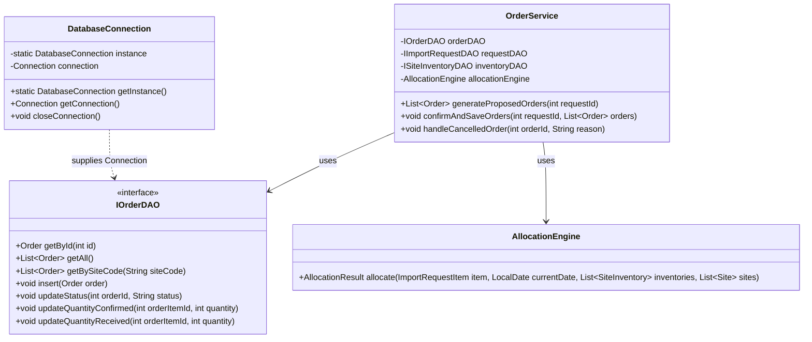

# TÀI LIỆU THIẾT KẾ KIẾN TRÚC & KẾ HOẠCH TRIỂN KHAI CHI TIẾT (MASTER BLUEPRINT)
## HỆ THỐNG ĐẶT HÀNG NHẬP KHẨU (IMPORT ORDER MANAGEMENT SYSTEM)

Tài liệu này được thiết kế như một **Bản thiết kế kỹ thuật chi tiết (Master Blueprint)**. Bất kỳ lập trình viên nào khi đọc tài liệu này cũng có thể hiểu rõ kiến trúc, thiết kế cơ sở dữ liệu, thuật toán phân bổ, định nghĩa API của các lớp và giao diện người dùng để lập trình chính xác 100% nghiệp vụ của hệ thống.

---

## 1. PHÂN TÍCH QUY TẮC NGHIỆP VỤ (BUSINESS RULES)

Hệ thống phải tuân thủ nghiêm ngặt các quy tắc nghiệp vụ sau trong suốt quá trình xử lý:

### 1.1 Quy tắc Tạo Yêu Cầu Nhập Hàng (BPBH - UC3)
*   **Ràng buộc số lượng**: Số lượng đặt hàng của mỗi mặt hàng phải $> 0$.
*   **Ràng buộc ngày giao mong muốn ($D_{target}$)**: Phải lớn hơn ngày hiện tại ít nhất là số ngày vận chuyển bằng đường hàng không của Site nhanh nhất có kinh doanh mặt hàng đó. Ràng buộc cơ bản: $D_{target} > D_{curr}$.
*   **Trạng thái ban đầu**: Một yêu cầu mới tạo luôn có trạng thái `PENDING`.

### 1.2 Quy tắc Phân Bổ Site Tự Động (BPĐHQT - UC17)
*   **Tính độc lập**: Xử lý phân bổ độc lập cho từng mặt hàng trong phiếu yêu cầu.
*   **Tính khả dụng của Site**: Một Site $S$ là khả dụng cho mặt hàng $M$ nếu:
    *   $S$ có kinh doanh $M$ và số lượng tồn kho của $S$ đối với $M$ ký hiệu là $Inventory(S, M) > 0$.
    *   Thời gian vận chuyển từ $S$ về kho đáp ứng được ngày giao mong muốn ($D_{target}$):
        *   Bằng đường tàu: $D_{curr} + S.shipDays \le D_{target}$ $\rightarrow$ Hợp lệ vận chuyển bằng **SHIP**.
        *   Bằng đường hàng không: $D_{curr} + S.airDays \le D_{target}$ $\rightarrow$ Hợp lệ vận chuyển bằng **AIR**.
*   **Thứ tự ưu tiên phân bổ**:
    1.  **Ưu tiên 1 (Phương tiện)**: Luôn ưu tiên phương án vận chuyển **SHIP** hơn **AIR** để tiết kiệm chi phí.
    2.  **Ưu tiên 2 (Tồn kho)**: Ưu tiên chọn Site có lượng hàng tồn kho đối với mặt hàng đó lớn hơn.
    3.  **Ưu tiên 3 (Tối thiểu hóa số lượng Site)**: Số lượng các Site được chọn để gom hàng phải là nhỏ nhất. (Giải quyết bằng cách sắp xếp lượng tồn kho giảm dần, lấy tối đa từ Site lớn trước).
*   **Xử lý thiếu hàng / trễ hạn**: Nếu duyệt hết toàn bộ các phương án khả dụng mà tổng số lượng phân bổ vẫn nhỏ hơn số lượng yêu cầu đặt hàng, hệ thống phải **dừng lại và báo lỗi chi tiết** cho nhân viên (không tạo đơn hàng lỗi nửa chừng).

### 1.3 Quy tắc Xác Nhận Đơn Hàng (Site - UC29 & UC30)
*   Khi đơn hàng ở trạng thái `PENDING` được gửi tới Site, đại diện Site có 2 lựa chọn:
    *   **Xác nhận (Confirm)**: Chuyển trạng thái đơn sang `CONFIRMED`.
    *   **Từ chối (Reject/Decline)**: Bắt buộc nhập lý do từ chối. Trạng thái đơn chuyển sang `CANCELLED`. Lúc này, số lượng tồn kho ảo tạm giữ của Site cho đơn hàng này sẽ được giải phóng (cộng trả lại tồn kho khả dụng của Site).

### 1.4 Quy tắc Xử Lý Đơn Hàng Hủy (BPĐHQT - UC20)
*   Khi một đơn hàng bị Site từ chối (`CANCELLED`), nhân viên BPĐHQT nhận được thông báo.
*   Hệ thống cung cấp tính năng **Tái phân bổ (Reallocate)**: Tách các mặt hàng của đơn bị hủy đó ra, chạy lại thuật toán phân bổ để tìm các Site khác thay thế (bỏ qua Site vừa hủy). Nếu tìm được Site thay thế, tạo đơn hàng mới thay thế. Nếu không thể phân bổ tiếp, thông báo lỗi thiếu hàng để nhân viên liên hệ xử lý thủ công.

### 1.5 Quy tắc Đối Chiếu Nhập Kho (BPQLK - UC33)
*   Khi hàng về tới kho, thủ kho BPQLK tiến hành kiểm hàng thực tế đối chiếu với đơn hàng.
*   **Nhập số lượng thực nhận**: Thủ kho điền số lượng thực tế nhận được của từng mặt hàng ($Q_{received}$).
*   **Xử lý sai lệch**:
    *   Nếu $Q_{received} == Q_{ordered}$: Đơn hàng chuyển sang trạng thái `DELIVERED`. Tạo phiếu nhập kho ở trạng thái Khớp.
    *   Nếu $Q_{received} < Q_{ordered}$ hoặc $Q_{received} > Q_{ordered}$: Hệ thống hiển thị cảnh báo sai lệch màu đỏ. Cho phép thủ kho xác nhận kèm ghi chú lý do sai lệch. Trạng thái đơn chuyển sang `DELIVERED` (hoặc trạng thái đặc biệt `PARTIALLY_RECEIVED` nếu thiếu trầm trọng).
*   **Đồng bộ tồn kho**: Sau khi hoàn thành phiếu nhập kho, hệ thống tự động đồng bộ (cộng thêm $Q_{received}$) vào kho hàng nội bộ của công ty.

---

## 2. KIẾN TRÚC HỆ THỐNG & SƠ ĐỒ LỚP CHI TIẾT (CLASS SPECIFICATIONS)

Hệ thống áp dụng kiến trúc **Layered MVC kết hợp DAO**. Dưới đây là đặc tả chi tiết của từng class chính gồm các thuộc tính và phương thức quan trọng:



### 2.1 Định nghĩa các Lớp Thực Thể (Domain Entities)

#### Class: `User`
*   `int id` (Primary Key)
*   `String username` (Unique)
*   `String passwordHash` (Mã hóa SHA-256)
*   `String fullName`
*   `UserRole role` (Enum: `BPBH`, `BPDHQT`, `SITE`, `BPQLK`, `ADMIN`)
*   `String siteCode` (Khóa ngoại, Nullable, chỉ dùng cho role `SITE`)
*   `boolean active`

#### Class: `Merchandise`
*   `String merchandiseCode` (Primary Key)
*   `String name`
*   `String description`
*   `String unit`
*   `double price`
*   `boolean active`

#### Class: `Site`
*   `String siteCode` (Primary Key)
*   `String name`
*   `int shipDays`
*   `int airDays`
*   `String otherInfo`
*   `boolean active`

#### Class: `SiteInventory`
*   `String siteCode` (Composite PK)
*   `String merchandiseCode` (Composite PK)
*   `int inStockQuantity`
*   `String unit`

#### Class: `ImportRequest`
*   `int id` (Primary Key)
*   `int createdBy` (FK -> User)
*   `LocalDate createdDate`
*   `RequestStatus status` (Enum: `PENDING`, `PROCESSING`, `APPROVED`, `REJECTED`)
*   `List<ImportRequestItem> items`

#### Class: `ImportRequestItem`
*   `int id` (Primary Key)
*   `int requestId` (FK -> ImportRequest)
*   `String merchandiseCode`
*   `int quantityOrdered`
*   `String unit`
*   `LocalDate desiredDeliveryDate`

#### Class: `Order`
*   `int id` (Primary Key)
*   `int requestId` (FK -> ImportRequest)
*   `String siteCode` (FK -> Site)
*   `DeliveryMethod deliveryMethod` (Enum: `SHIP`, `AIR`)
*   `OrderStatus status` (Enum: `PENDING`, `CONFIRMED`, `SHIPPED`, `DELIVERED`, `CANCELLED`)
*   `LocalDate createdDate`
*   `LocalDate estimatedArrival`
*   `String cancelReason`
*   `List<OrderItem> items`

#### Class: `OrderItem`
*   `int id` (Primary Key)
*   `int orderId` (FK -> Order)
*   `String merchandiseCode`
*   `int quantityOrdered`
*   `int quantityConfirmed`
*   `int quantityReceived`
*   `String unit`

### 2.2 Các Interface DAO & Phương thức (Tầng Dữ Liệu)

Tất cả các lớp DAO Implementation (`SQLiteUserDAO`, `SQLiteOrderDAO`, v.v.) bắt buộc phải triển khai các Interface sau:

```java
public interface IUserDAO {
    User getById(int id);
    User getByUsername(String username);
    List<User> getAll();
    void insert(User user);
    void update(User user);
}

public interface IMerchandiseDAO {
    Merchandise getByCode(String code);
    List<Merchandise> getAllActive();
    void insert(Merchandise merchandise);
    void update(Merchandise merchandise);
}

public interface IImportRequestDAO {
    ImportRequest getById(int id);
    List<ImportRequest> getByStatus(RequestStatus status);
    List<ImportRequest> getAll();
    int insert(ImportRequest request); // Trả về ID tự sinh
    void updateStatus(int requestId, RequestStatus status);
}

public interface IOrderDAO {
    Order getById(int id);
    List<Order> getAll();
    List<Order> getBySiteCode(String siteCode);
    List<Order> getByRequestId(int requestId);
    int insert(Order order); // Trả về ID tự sinh
    void updateStatus(int orderId, OrderStatus status);
    void updateCancelReason(int orderId, String reason);
    void updateItemQuantities(int orderItemId, int confirmedQty, int receivedQty);
}

public interface ISiteInventoryDAO {
    List<SiteInventory> getByMerchandiseCode(String merchandiseCode);
    SiteInventory get(String siteCode, String merchandiseCode);
    void updateStock(String siteCode, String merchandiseCode, int newQuantity);
}
```

---

## 3. THUẬT TOÁN PHÂN BỔ CHI TIẾT (DETAILED ALGORITHMIC PSEUDOCODE)

Thuật toán phân bổ tự động là **lõi xử lý quan trọng nhất** của hệ thống. Dưới đây là mã giả (pseudocode) chi tiết cho thuật toán này trong lớp `AllocationEngine.java`:

### Cấu trúc dữ liệu bổ trợ:
```java
class AllocationOption {
    Site site;
    DeliveryMethod method;
    int maxCapacity;
    int transportDays;
    LocalDate arrivalDate;
}

class AllocationDetail {
    Site site;
    DeliveryMethod method;
    int allocatedQuantity;
    LocalDate estimatedArrivalDate;
}
```

### Thuật toán phân bổ cho 1 dòng mặt hàng (`ImportRequestItem`):

```
HÀM allocate(RequestItem item, CurrentDate currentDate, List<SiteInventory> inventories, List<Site> sites):
    ĐẦU VÀO: 
        - item (chứa merchandiseCode, quantityOrdered, desiredDeliveryDate)
        - currentDate (ngày hiện tại chạy thuật toán)
        - inventories (danh sách tồn kho của mặt hàng này trên tất cả các Site)
        - sites (danh sách thông tin vận chuyển của tất cả các Site)
    ĐẦU RA:
        - Danh sách AllocationDetail phân bổ tối ưu, hoặc ném ra Ngoại lệ (Exception) nếu thất bại.

    Bước 1: Khởi tạo danh sách các phương án vận chuyển khả dụng (Feasible Options)
    Khởi tạo list FeasibleOptions = []
    
    Với mỗi inventory trong inventories:
        Nếu inventory.inStockQuantity <= 0:
            Tiếp tục vòng lặp (bỏ qua Site này)
            
        Tìm site tương ứng trong danh sách sites có siteCode == inventory.siteCode
        Nếu không tìm thấy hoặc site.active == false:
            Tiếp tục vòng lặp
            
        // Kiểm tra phương án vận chuyển bằng Tàu (SHIP)
        Ngày_nhận_dự_kiến_SHIP = currentDate + site.shipDays
        Nếu Ngày_nhận_dự_kiến_SHIP <= item.desiredDeliveryDate:
            Thêm vào FeasibleOptions đối tượng Option(
                site = site,
                method = SHIP,
                maxCapacity = inventory.inStockQuantity,
                transportDays = site.shipDays,
                arrivalDate = Ngày_nhận_dự_kiến_SHIP
            )
            
        // Kiểm tra phương án vận chuyển bằng Máy bay (AIR)
        Ngày_nhận_dự_kiến_AIR = currentDate + site.airDays
        Nếu Ngày_nhận_dự_kiến_AIR <= item.desiredDeliveryDate:
            Thêm vào FeasibleOptions đối tượng Option(
                site = site,
                method = AIR,
                maxCapacity = inventory.inStockQuantity,
                transportDays = site.airDays,
                arrivalDate = Ngày_nhận_dự_kiến_AIR
            )

    Bước 2: Sắp xếp các phương án khả dụng theo đúng tiêu chí đề bài
    Sắp xếp FeasibleOptions theo thứ tự ưu tiên giảm dần:
        - So sánh 1: Nếu OptionA.method != OptionB.method:
            Ưu tiên SHIP trước. (SHIP xếp trước AIR)
        - So sánh 2: Nếu cùng phương thức vận chuyển, so sánh lượng tồn kho (maxCapacity):
            Site có maxCapacity lớn hơn xếp trước (giảm dần)
        - So sánh 3: Nếu cùng tồn kho, chọn Site có thời gian vận chuyển ngắn hơn (nhỏ nhất)

    Bước 3: Thực hiện phân bổ số lượng tham lam (Greedy Allocation)
    Khởi tạo lượng_cần_phân_bổ = item.quantityOrdered
    Khởi tạo list Phân_Bổ_Kết_Quả = []
    
    Với mỗi option trong danh sách FeasibleOptions đã sắp xếp:
        Nếu lượng_cần_phân_bổ <= 0:
            Thoát vòng lặp
            
        Lượng_lấy = MIN(lượng_cần_phân_bổ, option.maxCapacity)
        
        Thêm vào Phân_Bổ_Kết_Quả đối tượng Detail(
            site = option.site,
            method = option.method,
            allocatedQuantity = Lượng_lấy,
            estimatedArrivalDate = option.arrivalDate
        )
        
        lượng_cần_phân_bổ = lượng_cần_phân_bổ - Lượng_lấy

    Bước 4: Kiểm tra kết quả
    Nếu lượng_cần_phân_bổ > 0:
        Ném ra Ngoại lệ: "Không đủ lượng hàng tồn kho khả dụng hoặc không đáp ứng kịp thời gian giao hàng mong muốn cho mặt hàng: " + item.merchandiseCode
        
    Trả về Phân_Bổ_Kết_Quả
```

---

## 4. SCHEMA CƠ SỞ DỮ LIỆU & DỮ LIỆU KHỞI TẠO MẪU (SEED DATA)

Để hệ thống có thể chạy demo ngay lập tức với đầy đủ các nghiệp vụ, cơ sở dữ liệu SQLite cần được nạp sẵn dữ liệu mẫu (Seed Data) chuẩn hóa sau đây:

### 4.1 SQL Dữ liệu mẫu khởi tạo tài khoản nhân viên (5 Roles)
```sql
-- Mật khẩu mẫu cho tất cả các tài khoản là: "123456" 
-- Đã được mã hóa SHA-256: "8d969ee56d10fa0e57ba40657a11ee031153e028a744e4416ee289304e229a09"

INSERT INTO users (username, password_hash, full_name, role, site_code, active) VALUES
('dung_bpbh', '8d969ee56d10fa0e57ba40657a11ee031153e028a744e4416ee289304e229a09', 'Nguyễn Trí Dũng', 'BPBH', NULL, 1),
('hung_bpdh', '8d969ee56d10fa0e57ba40657a11ee031153e028a744e4416ee289304e229a09', 'Đỗ Thành Hưng', 'BPDHQT', NULL, 1),
('tung_bpdh', '8d969ee56d10fa0e57ba40657a11ee031153e028a744e4416ee289304e229a09', 'Lê Hoàng Tùng', 'BPDHQT', NULL, 1),
('minh_bpdh', '8d969ee56d10fa0e57ba40657a11ee031153e028a744e4416ee289304e229a09', 'Nguyễn Vũ Minh', 'BPDHQT', NULL, 1),
('site_tokyo', '8d969ee56d10fa0e57ba40657a11ee031153e028a744e4416ee289304e229a09', 'Đại diện Site Tokyo', 'SITE', 'S_TOK', 1),
('site_seoul', '8d969ee56d10fa0e57ba40657a11ee031153e028a744e4416ee289304e229a09', 'Đại diện Site Seoul', 'SITE', 'S_SEO', 1),
('site_sing', '8d969ee56d10fa0e57ba40657a11ee031153e028a744e4416ee289304e229a09', 'Đại diện Site Singapore', 'SITE', 'S_SIN', 1),
('thai_bpqlk', '8d969ee56d10fa0e57ba40657a11ee031153e028a744e4416ee289304e229a09', 'Nguyễn Quang Thái', 'BPQLK', NULL, 1),
('admin_sys', '8d969ee56d10fa0e57ba40657a11ee031153e028a744e4416ee289304e229a09', 'Quản trị viên Hệ thống', 'ADMIN', NULL, 1);
```

### 4.2 SQL Dữ liệu mẫu đối tác Site & Mặt hàng
```sql
-- Thêm các Site nhập khẩu mẫu (ship_days và air_days khác nhau để test thuật toán)
INSERT INTO sites (site_code, name, ship_days, air_days, other_info, active) VALUES
('S_TOK', 'Tokyo Import Site (Japan)', 15, 3, 'Đối tác Nhật Bản, uy tín cao', 1),
('S_SEO', 'Seoul Import Site (South Korea)', 12, 2, 'Đối tác Hàn Quốc, giá tốt', 1),
('S_SIN', 'Singapore Cargo Hub', 7, 1, 'Hub trung chuyển lớn nhất Đông Nam Á', 1);

-- Thêm các mặt hàng kinh doanh
INSERT INTO merchandise (merchandise_code, name, description, unit, price, active) VALUES
('M_CPU_I7', 'Intel Core i7 13700K', 'Bộ vi xử lý thế hệ 13', 'Cái', 420.0, 1),
('M_GPU_RTX4070', 'NVIDIA GeForce RTX 4070', 'Card đồ họa cao cấp', 'Cái', 650.0, 1),
('M_RAM_16G', 'Corsair Vengeance DDR5 16GB', 'Bộ nhớ trong hiệu năng cao', 'Thanh', 75.0, 1),
('M_SSD_1T', 'Samsung 990 Pro 1TB NVMe', 'Ổ cứng thể rắn tốc độ cực cao', 'Cái', 110.0, 1);

-- Thêm tồn kho thực tế cho từng Site đối với từng mặt hàng để test phân bổ
INSERT INTO site_inventory (site_code, merchandise_code, in_stock_quantity, unit) VALUES
-- Tồn kho tại Singapore (vận chuyển siêu nhanh: ship 7 ngày, air 1 ngày nhưng tồn kho ít)
('S_SIN', 'M_CPU_I7', 10, 'Cái'),
('S_SIN', 'M_GPU_RTX4070', 5, 'Cái'),
('S_SIN', 'M_RAM_16G', 30, 'Thanh'),
('S_SIN', 'M_SSD_1T', 25, 'Cái'),

-- Tồn kho tại Seoul (vận chuyển trung bình: ship 12 ngày, air 2 ngày, tồn kho khá lớn)
('S_SEO', 'M_CPU_I7', 50, 'Cái'),
('S_SEO', 'M_GPU_RTX4070', 20, 'Cái'),
('S_SEO', 'M_RAM_16G', 100, 'Thanh'),
('S_SEO', 'M_SSD_1T', 80, 'Cái'),

-- Tồn kho tại Tokyo (vận chuyển chậm nhất: ship 15 ngày, air 3 ngày, tồn kho cực lớn)
('S_TOK', 'M_CPU_I7', 150, 'Cái'),
('S_TOK', 'M_GPU_RTX4070', 80, 'Cái'),
('S_TOK', 'M_RAM_16G', 300, 'Thanh'),
('S_TOK', 'M_SSD_1T', 200, 'Cái');
```

---

## 5. THIẾT KẾ CHI TIẾT GIAO DIỆN FXML & UI CHO 6 USE CASES CỐT LÕI

Để lập trình viên thiết kế giao diện bằng **JavaFX Scene Builder** chính xác, dưới đây là chi tiết cấu trúc FXML và các UI Elements bắt buộc phải có cho 6 use cases cốt lõi:

### UC2: Xem Yêu Cầu Nhập Hàng BPBH (Nguyễn Trí Dũng)
*   **Tên file FXML**: `bpbh/import_request_detail.fxml`
*   **Bố cục (Layout)**: `VBox` làm gốc, bên trong chia làm 2 vùng:
    *   *Vùng 1 (Header)*: `GridPane` hiển thị thông tin chung:
        *   Mã yêu cầu (Label, `id="lblRequestId"`)
        *   Ngày tạo (Label, `id="lblCreatedDate"`)
        *   Người tạo (Label, `id="lblCreatedBy"`)
        *   Trạng thái (Label, `id="lblStatus"`, tự động đổi màu: Chờ xử lý = Cam, Đã duyệt = Xanh lá, Bị từ chối = Đỏ).
    *   *Vùng 2 (Table)*: `TableView` hiển thị danh sách mặt hàng yêu cầu (`id="tblRequestItems"`):
        *   Cột 1: Mã mặt hàng (`TableColumn`, `id="colMerchandiseCode"`)
        *   Cột 2: Tên mặt hàng (`TableColumn`, `id="colMerchandiseName"`)
        *   Cột 3: Số lượng đặt (`TableColumn`, `id="colQuantity"`)
        *   Cột 4: Đơn vị tính (`TableColumn`, `id="colUnit"`)
        *   Cột 5: Ngày nhận mong muốn (`TableColumn`, `id="colDesiredDate"`)
    *   *Vùng 3 (Action)*: Nút "Đóng" (`Button`, `id="btnClose"`, quay về danh sách).

### UC16: Xem Đơn Hàng BPĐHQT (Lê Hoàng Tùng)
*   **Tên file FXML**: `bpdhqt/order_detail.fxml`
*   **Bố cục (Layout)**: `BorderPane`.
    *   *Phần Top*: Tiêu đề lớn "CHI TIẾT ĐƠN HÀNG NHẬP KHẨU" kèm mã đơn hàng (`Label`, `id="lblOrderId"`).
    *   *Phần Center*: `ScrollPane` cuộn chứa 2 thẻ thông tin (`TitledPane`):
        *   *Thẻ 1: Thông tin chung đơn hàng*: Hiển thị Mã Site đối tác, Phương thức vận chuyển (Tàu/Air), Ngày tạo đơn, Ngày giao hàng dự kiến, Trạng thái đơn hàng.
        *   *Thẻ 2: Danh sách mặt hàng trong đơn*: `TableView` (`id="tblOrderItems"`):
            *   Cột 1: Mã hàng | Cột 2: Tên hàng | Cột 3: SL Đặt | Cột 4: SL Site Xác Nhận | Cột 5: SL Thực Nhận.
    *   *Phần Bottom*: `HBox` căn phải chứa các nút chức năng:
        *   Nút "Quay lại" (`Button`, `id="btnBack"`)
        *   Nút "Hủy đơn hàng" (`Button`, `id="btnCancelOrder"`, chỉ hiển thị khi trạng thái là `PENDING`).

### UC17: Tạo Đơn Hàng Tự Động Phân Bổ (Đỗ Thành Hưng) ⭐ Phức tạp nhất
*   **Tên file FXML**: `bpdhqt/request_processing.fxml`
*   **Bố cục**: `SplitPane` chia đôi màn hình Trái/Phải:
    *   **Bên trái (Danh sách yêu cầu PENDING)**:
        *   `TableView` (`id="tblPendingRequests"`) hiển thị mã yêu cầu, ngày tạo, người tạo.
        *   Khi click chọn 1 dòng, bảng bên dưới hiển thị chi tiết các mặt hàng cần đặt.
        *   Nút **"Chạy Phân Bổ Tự Động"** (`Button`, `id="btnRunAllocation"`, style màu Accent).
    *   **Bên phải (Kết quả Phân bổ Đề xuất)**:
        *   Ban đầu để trống/hiển thị hướng dẫn. Sau khi bấm Chạy Phân Bổ, vùng này hiện:
        *   `TableView` (`id="tblAllocationProposed"`) hiển thị phương án:
            *   Cột 1: Mã hàng | Cột 2: Lấy từ Site | Cột 3: Vận chuyển bằng (SHIP/AIR) | Cột 4: Số lượng lấy | Cột 5: Ngày về dự kiến.
        *   Một nhãn cảnh báo (`Label`, `id="lblAllocationError"`, màu đỏ, ẩn đi nếu phân bổ thành công).
        *   Nút **"Phê duyệt & Tạo các Đơn Hàng"** (`Button`, `id="btnApproveOrders"`, màu xanh lá, chỉ enable khi phân bổ thành công).

### UC20: Xử Lý Đơn Hàng Hủy (Nguyễn Vũ Minh)
*   **Tên file FXML**: `bpdhqt/cancelled_order_handler.fxml`
*   **Bố cục**: `VBox`.
    *   Hiển thị thông tin đơn hàng vừa bị Site hủy/từ chối kèm **Lý do từ chối** (`TextArea`, readonly).
    *   Danh sách các mặt hàng bị kẹt cần xử lý.
    *   Cung cấp 2 lựa chọn xử lý:
        1.  Nút "Tự động tìm Site thay thế" (`Button`, `id="btnReallocate"`): Hệ thống chạy lại thuật toán phân bổ loại trừ Site cũ. Hiển thị phương án thay thế lên bảng đối chiếu.
        2.  Nút "Hủy hoàn toàn" (`Button`, `id="btnForceCancel"`): Hủy toàn bộ luồng, hoàn tiền/thông báo lại cho BPBH.

### UC29: Xem Đơn Hàng Dành Cho Site (Nguyễn Thiện Nam - Thiết kế lại)
*   **Tên file FXML**: `site/site_order_list.fxml` & `site/site_order_detail.fxml`
*   **Mô tả**: Đây là màn hình dành riêng cho đối tác nước ngoài đăng nhập.
    *   *Màn hình Danh sách*: Hiển thị tất cả đơn hàng gửi tới Site này. Có bộ lọc Trạng thái (`ComboBox`: PENDING, CONFIRMED, SHIPPED).
    *   *Màn hình Chi tiết*: Hiển thị danh sách mặt hàng, số lượng đặt, đơn giá, tổng tiền.
    *   Dưới góc màn hình có 2 nút hành động lớn:
        *   Nút **"Xác nhận cung cấp đơn hàng"** (`Button`, `id="btnConfirm"`, màu xanh dương).
        *   Nút **"Từ chối đơn hàng"** (`Button`, `id="btnReject"`, màu đỏ). Khi bấm nút này, hiện một Popup yêu cầu nhập lý do từ chối trước khi xác nhận hủy đơn.

### UC33: Xác Nhận Nhập Kho BPQLK (Nguyễn Quang Thái)
*   **Tên file FXML**: `bpqlk/warehouse_confirm.fxml`
*   **Bố cục**: `VBox` chứa bảng đối chiếu nhập hàng.
    *   `TableView` (`id="tblWarehouseCheck"`):
        *   Cột 1: Mã mặt hàng | Cột 2: Tên mặt hàng
        *   Cột 3: Số lượng đặt mua từ đơn hàng (Read-only)
        *   Cột 4: Số lượng thực tế nhận được tại kho (Cột này là **TextField editable**, cho phép thủ kho gõ số lượng kiểm đếm được).
        *   Cột 5: Chênh lệch (Tự động tính: Thực nhận - Đặt mua).
    *   **Quy trình hiển thị**: Khi chênh lệch $\neq 0$, dòng đó sẽ tự động được tô màu nền đỏ nhạt để cảnh báo thủ kho kiểm tra kỹ lại.
    *   Ô nhập ghi chú (`TextArea`, `id="txtNotes"`, dùng để thủ kho ghi lý do nếu có chênh lệch).
    *   Nút **"Xác nhận nhập kho & Đồng bộ tồn kho"** (`Button`, `id="btnSubmitReceipt"`, màu xanh lá).

---

## 6. TIẾN TRÌNH LUỒNG ĐI DỮ LIỆU ĐỒNG BỘ (DATA FLOWS - BCE PATTERN)

Dưới đây là mô hình trao đổi thông tin cụ thể giữa tầng View, Controller, Service, DAO và Database khi thực hiện **Tạo Đơn Hàng Tự Động (UC17)**:

```
[Màn hình Request UI] 
       │ 
       │ (1) Click "Chạy Phân Bổ"
       ▼
[RequestProcessingController] 
       │ 
       │ (2) Gọi calculateAllocation(requestId)
       ▼
[OrderService] 
       │ 
       │ (3) Gọi allocate(...)
       ▼
[AllocationEngine] (Thực hiện thuật toán Greedy tối ưu)
       │ 
       │ (4) Trả về AllocationResult
       ▼
[OrderService] 
       │ 
       │ (5) Trả về Kết quả đề xuất cho Controller
       ▼
[RequestProcessingController] (Hiển thị phương án trực quan cho Người dùng duyệt)
       │ 
       │ (6) Người dùng bấm "Phê duyệt"
       ▼
[RequestProcessingController]
       │ 
       │ (7) Gọi confirmAndSaveOrders(requestId, proposedOrders)
       ▼
[OrderService] 
       │ 
       │ (8) Duyệt qua từng đơn hàng gom theo Site
       ▼
[SQLiteOrderDAO] 
       │ 
       │ (9) INSERT INTO orders & order_items
       ▼
[Database SQLite] 
```

---

## 7. KẾ HOẠCH TRIỂN KHAI TỪNG BƯỚC KHÉP KÍN (IMPLEMENTATION SEQUENCE)

Để xây dựng hệ thống chính xác, bạn hãy tiến hành code theo đúng trình tự các bước dưới đây:

### Bước 1: Setup Môi Trường & Kết Nối Database
1.  Tạo thư mục dự án theo đúng sơ đồ ở **Mục 1**.
2.  Tạo file `pom.xml` cấu hình JavaFX 21, SQLite JDBC, JUnit 5.
3.  Tạo file cơ sở dữ liệu `import_system.db`, viết file `schema.sql` (ở **Mục 4**) để khởi tạo database rỗng.
4.  Viết lớp `DatabaseConnection.java` theo mẫu thiết kế Singleton để kiểm soát kết nối database an toàn.

### Bước 2: Lập Trình Tầng DAO (Data Access Object)
1.  Viết tất cả các Interface DAO: `IUserDAO`, `IMerchandiseDAO`, `IImportRequestDAO`, `IOrderDAO`, `ISiteInventoryDAO`.
2.  Lần lượt viết các class triển khai (Implementation) trên nền SQLite: `SQLiteUserDAO`, `SQLiteMerchandiseDAO`, `SQLiteImportRequestDAO`, `SQLiteOrderDAO`, `SQLiteSiteInventoryDAO`.
3.  Viết class `DatabaseSeeder` chạy một lần để nạp toàn bộ Dữ liệu mẫu (Seed Data) ở **Mục 4** vào database để chúng ta có dữ liệu chạy test các tính năng tiếp theo.

### Bước 3: Lập Trình Thuật Toán Phân Bổ (Core Logic)
1.  Lập trình lớp `AllocationEngine.java` theo đúng mã giả thuật toán phân bổ tối ưu ở **Mục 3**.
2.  **Viết Unit Test**: Tạo file `AllocationEngineTest.java` trong thư mục `test`. Viết ít nhất 5 test cases để xác minh thuật toán chia hàng chính xác theo ưu tiên SHIP > AIR, ưu tiên tồn kho lớn và gom gọn Site ít nhất. Chạy kiểm thử thành công trước khi chuyển sang bước UI.

### Bước 4: Lập Trình Khung Giao Diện (Shell UI & Auth)
1.  Viết `AuthService` kiểm tra đăng nhập.
2.  Thiết kế file FXML đăng nhập (`login.fxml`) và `LoginController`.
3.  Thiết kế khung giao diện chính (`main.fxml`) gồm sidebar bên trái và nội dung bên phải. Thiết kế `SidebarController` để tự động ẩn/hiện menu chức năng dựa trên vai trò của tài khoản đang đăng nhập.

### Bước 5: Lập Trình Nghiệp Vụ BP Bán Hàng (BPBH)
1.  Viết `ImportRequestService` xử lý nghiệp vụ yêu cầu.
2.  Thiết kế FXML danh sách yêu cầu nhập hàng và màn hình tạo mới yêu cầu (cho phép thêm mặt hàng, chọn ngày mong muốn).
3.  Hoàn thiện **UC2 (Xem chi tiết yêu cầu)** bằng cách liên kết bảng hiển thị chi tiết các mặt hàng.

### Bước 6: Lập Trình Nghiệp Vụ BP Đặt Hàng Quốc Tế (BPĐHQT)
1.  Viết `OrderService` điều phối tạo đơn hàng và reallocate đơn hàng hủy.
2.  Thiết kế màn hình **UC17 (Xử lý yêu cầu & Tự động phân bổ)**. Liên kết nút bấm với `AllocationEngine` đã viết ở Bước 3. Hiển thị bảng phân bổ đề xuất và nút Duyệt tạo đơn hàng.
3.  Thiết kế màn hình **UC16 (Xem chi tiết đơn hàng)** và **UC20 (Xử lý đơn hủy)**.

### Bước 7: Lập Trình Nghiệp Vụ Site & Quản Lý Kho (BPQLK)
1.  Thiết kế màn hình **UC29 & UC30 (Xem & Xác nhận đơn hàng dành cho Site)**.
2.  Thiết kế màn hình **UC33 (Xác nhận nhập kho của BPQLK)** cho phép thủ kho điền số lượng thực nhận, cảnh báo đỏ nếu chênh lệch, và bấm hoàn tất để tự động cập nhật tồn kho nội bộ của công ty.

### Bước 8: Kiểm Thử Toàn Diện (End-to-End Test)
1.  Chạy ứng dụng.
2.  Thực hiện tạo một yêu cầu nhập hàng mới với tài khoản BPBH (`dung_bpbh`).
3.  Đăng nhập tài khoản BPĐHQT (`hung_bpdh`) để xử lý phân bổ tự động thành công 2 đơn hàng gửi đi.
4.  Đăng nhập tài khoản Site Seoul (`site_seoul`) để xác nhận 1 đơn hàng và từ chối 1 đơn hàng.
5.  Quay lại tài khoản BPĐHQT để xử lý tái phân bổ đơn bị từ chối sang Site Tokyo.
6.  Đăng nhập tài khoản Site Tokyo để xác nhận đơn hàng thay thế.
7.  Đăng nhập tài khoản BPQLK (`thai_bpqlk`) để nhận hàng và xác nhận nhập kho thành công.
8.  Kiểm tra dữ liệu trong database xem tồn kho nội bộ đã được cộng chính xác chưa.
